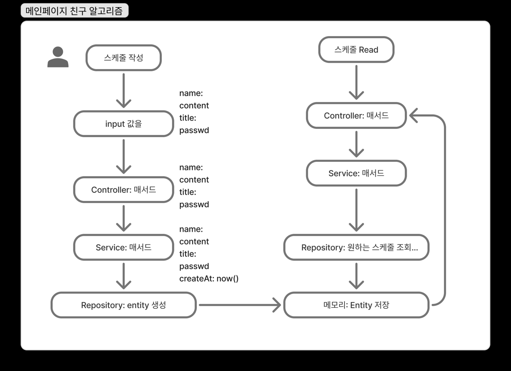
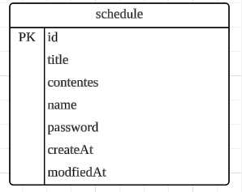

API 명세서
다음은 이전 응답에서 제공한 API 명세서 내용입니다. 이 부분을 복사해서 사용하시면 됩니다.

--- 절취선 ---

API 명세서: 일정 관리 API
이 문서는 제공된 ScdController.java와 관련 서비스 코드를 기반으로 작성된 RESTful API 명세서입니다.

1. 일정 생성 (일정 등록)
   엔드포인트: /

HTTP 메소드: POST

설명: 새로운 일정을 생성합니다.

요청 (Request)

요청 본문 (Request Body): ScdPostRequestDto 객체

JSON

{
"title": "String",
"contents": "String",
"name": "String",
"password": "String"
}
응답 (Response)

성공 상태 코드: 201 Created

응답 본문: ScdResponseDto 객체. 생성된 일정의 정보가 포함됩니다.

JSON

{
"title": "String",
"contents": "String",
"name": "String",
"createAt": "LocalDateTime",
"modifiedAt": "LocalDateTime"
}
2. 모든 일정 조회
   엔드포인트: /schedule

HTTP 메소드: GET

설명: 시스템에 저장된 모든 일정을 조회합니다.

요청 (Request)

요청 매개변수: 없음

응답 (Response)

성공 상태 코드: 200 OK

응답 본문: ScdResponseDto 객체 리스트. 모든 일정 정보가 배열 형태로 반환됩니다.

JSON

[
{
"title": "String",
"contents": "String",
"name": "String",
"createAt": "LocalDateTime",
"modifiedAt": "LocalDateTime"
},
...
]
3. 이름으로 일정 조회
   엔드포인트: /schedule/{Name}

HTTP 메소드: GET

설명: 특정 이름으로 작성된 일정을 조회합니다.

요청 (Request)

경로 매개변수 (Path Variable):

Name (String): 조회할 일정 작성자의 이름

응답 (Response)

성공 상태 코드: 200 OK

응답 본문: ScdResponseDto 객체 리스트. 해당 이름으로 작성된 모든 일정 정보가 반환됩니다.

JSON

[
{
"title": "String",
"contents": "String",
"name": "String",
"createAt": "LocalDateTime",
"modifiedAt": "LocalDateTime"
},
...
]
4. 일정 수정
   엔드포인트: /schedule/{id}

HTTP 메소드: PATCH

설명: 특정 ID의 일정을 수정합니다. 수정하려면 비밀번호가 일치해야 합니다.

요청 (Request)

경로 매개변수 (Path Variable):

id (Long): 수정할 일정의 고유 ID

요청 본문 (Request Body): ScdPatchRequestDto 객체

JSON

{
"password": "String",
"title": "String",
"name": "String"
}
응답 (Response)

성공 상태 코드: 200 OK

응답 본문: ScdResponseDto 객체. 수정된 일정의 정보가 반환됩니다.

JSON

{
"title": "String",
"contents": "String",
"name": "String",
"createAt": "LocalDateTime",
"modifiedAt": "LocalDateTime"
}
오류 응답: 비밀번호가 일치하지 않거나 ID가 유효하지 않은 경우, null이 반환될 수 있습니다.

5. 일정 삭제
   엔드포인트: /schedule/{id}/del

HTTP 메소드: DELETE

설명: 특정 ID의 일정을 삭제합니다. 삭제하려면 비밀번호가 일치해야 합니다.

요청 (Request)

경로 매개변수 (Path Variable):

id (Long): 삭제할 일정의 고유 ID

요청 본문 (Request Body): ScdDeleteRequestDto 객체

JSON

{
"password": "String"
}
응답 (Response)

성공 상태 코드: 200 OK

응답 본문: ScdResponseDto 객체 리스트. 삭제 후 남은 모든 일정 정보가 배열 형태로 반환됩니다.

JSON

[
{
"title": "String",
"contents": "String",
"name": "String",
"createAt": "LocalDateTime",
"modifiedAt": "LocalDateTime"
},
...
]
오류 응답: 비밀번호가 일치하지 않거나 ID가 유효하지 않은 경우, 일정이 삭제되지 않고 기존 리스트가 그대로 반환될 수 있습니다.
